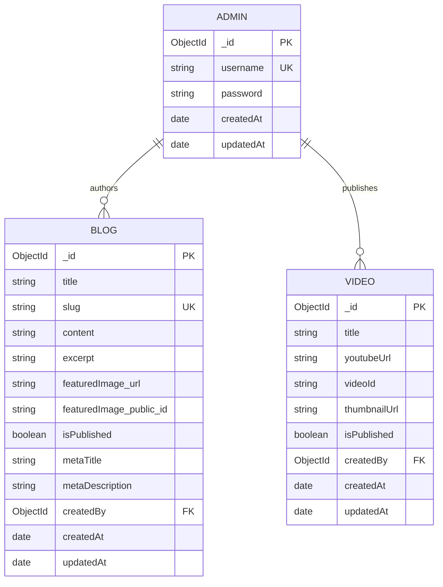

# Database Documentation — Rawnaf Care MVP

This document details the MongoDB Atlas database architecture, Mongoose schemas, indexing strategy, data validation, aggregation pipelines, sample data, and Entity-Relationship Diagram (ERD) for **Rawnaf Care MVP**.

---

## 1. Collection List

The system uses **MongoDB Atlas (M0 Cloud Tier)** with three core collections managed via Mongoose ORM:

| Collection Name | Mongoose Model | Description | Data Retention / Lifecycle |
| :--- | :--- | :--- | :--- |
| `admins` | `Admin` | Stores administrative user credentials for secure dashboard login. | Persisted (Bootstrapped via seed script) |
| `blogs` | `Blog` | Stores health articles, rich text content, SEO metadata, and Cloudinary media details. | Persisted (Managed by Admin) |
| `videos` | `Video` | Stores curated YouTube health video entries, derived thumbnails, and publication status. | Persisted (Managed by Admin) |

> [!IMPORTANT]  
> **Privacy by Design (Stateless Calculators):** All interactive health tools (BMI Calculator, Fertile Window Calculator, Diabetes Risk Calculator, Child Growth Tracker) operate **100% client-side in browser memory**. Zero user health metrics or calculation results are persisted to any database collection.

---

## 2. Schema Specifications

### 2.1 `Admin` Collection Schema
- **Purpose:** Stores admin authentication credentials.
- **Fields:**
  - `_id`: `ObjectId` — Auto-generated primary key.
  - `username`: `String` — Required, unique, trimmed, min 3 chars, max 50 chars.
  - `password`: `String` — Required, bcrypt hashed password string.
  - `createdAt`: `Date` — Timestamp of creation (Auto).
  - `updatedAt`: `Date` — Timestamp of last update (Auto).

### 2.2 `Blog` Collection Schema
- **Purpose:** Stores blog post articles, ASCII slugs, status, and Cloudinary image details.
- **Fields:**
  - `_id`: `ObjectId` — Auto-generated primary key.
  - `title`: `String` — Required, trimmed, max 150 characters.
  - `slug`: `String` — Required, unique, lowercase, ASCII-transliterated slug for SEO URLs.
  - `content`: `String` — Required, rich text HTML/Markdown content.
  - `excerpt`: `String` — Optional, trimmed, max 300 characters.
  - `featuredImage`: `Object` — Optional nested object:
    - `url`: `String` — Cloudinary secure URL (`https://res.cloudinary.com/...`).
    - `public_id`: `String` — Cloudinary asset identifier (used for cloud cleanup upon update/delete).
  - `isPublished`: `Boolean` — Default `false`. Controls visibility on public feed.
  - `metaTitle`: `String` — Optional, max 160 characters (SEO override).
  - `metaDescription`: `String` — Optional, max 160 characters (SEO override).
  - `createdBy`: `ObjectId` — Ref to `Admin` model (Optional).
  - `createdAt`: `Date` — Auto timestamp.
  - `updatedAt`: `Date` — Auto timestamp.

### 2.3 `Video` Collection Schema
- **Purpose:** Stores video advice metadata and YouTube embeds.
- **Fields:**
  - `_id`: `ObjectId` — Auto-generated primary key.
  - `title`: `String` — Required, trimmed, max 150 characters.
  - `youtubeUrl`: `String` — Required, validated YouTube URL regex.
  - `videoId`: `String` — Required, unique, extracted 11-character YouTube Video ID.
  - `thumbnailUrl`: `String` — Required, auto-derived thumbnail (`https://img.youtube.com/vi/<videoId>/hqdefault.jpg`).
  - `isPublished`: `Boolean` — Default `false`. Controls visibility on public video gallery.
  - `createdBy`: `ObjectId` — Ref to `Admin` model (Optional).
  - `createdAt`: `Date` — Auto timestamp.
  - `updatedAt`: `Date` — Auto timestamp.

---

## 3. Relationships

In this MVP phase, collections operate independently to maximize simplicity:

```
+----------------+          1 : N (Optional)          +----------------+
|     Admin      | ----------------------------------< |      Blog      |
+----------------+                                    +----------------+
        |
        |                   1 : N (Optional)          +----------------+
        +-------------------------------------------< |     Video      |
                                                      +----------------+
```

- **`Admin` → `Blog` (1 : N):** An Admin can author multiple blog posts. The `Blog.createdBy` field references `Admin._id`.
- **`Admin` → `Video` (1 : N):** An Admin can publish multiple video links. The `Video.createdBy` field references `Admin._id`.

---

## 4. Indexing Strategy

Indexes are created to optimize query speed and enforce data integrity.

| Collection | Index Fields | Type | Purpose |
| :--- | :--- | :--- | :--- |
| `admins` | `{ username: 1 }` | Unique | Fast lookup during login; prevents duplicate admin usernames. |
| `blogs` | `{ slug: 1 }` | Unique | 0ms collision check and fast dynamic page lookup by slug. |
| `blogs` | `{ isPublished: 1, createdAt: -1 }` | Compound | Fast paginated public blog feed (`/api/blogs?page=1&limit=10`). |
| `blogs` | `{ title: "text", excerpt: "text" }` | Text | Enables MongoDB text search for `?search=query` public filtering. |
| `videos` | `{ videoId: 1 }` | Unique | Fast lookup and prevents duplicate YouTube video entries. |
| `videos` | `{ isPublished: 1, createdAt: -1 }` | Compound | Fast paginated public video gallery feed (`/api/videos?page=1&limit=10`). |

---

## 5. Data Validation & Constraints

1. **Blog Character Caps:**
   - `title`: Max 150 chars.
   - `excerpt`: Max 300 chars.
   - `metaTitle` / `metaDescription`: Max 160 chars.
2. **YouTube URL Regex Validation:**
   - Regex: `^(https?:\/\/)?(www\.)?(youtube\.com\/watch\?v=|youtu\.be\/)([a-zA-Z0-9_-]{11})`
3. **MIME Type & File Upload Hard Caps (Multer + Mongoose):**
   - Allowed MIME types: `image/jpeg`, `image/png`, `image/webp`.
   - Max image size: 2MB cap enforced before saving `featuredImage.url`.
4. **Unique Slug Guarantee:**
   - Transliterated Bengali title + fallback `-1`, `-2` resolution guaranteed by MongoDB `{ slug: 1 }` unique index.

---

## 6. Aggregation Pipelines

### 6.1 Public Search & Paginated Blogs
Used for `GET /api/blogs?page=1&limit=10&search=nutrition`:

```javascript
const page = 1;
const limit = 10;
const searchQuery = "nutrition";

const pipeline = [
  // 1. Filter published posts & optional text search
  {
    $match: {
      isPublished: true,
      ...(searchQuery ? { $text: { $search: searchQuery } } : {})
    }
  },
  // 2. Sort by search score (if search) or newest creation date
  {
    $sort: searchQuery 
      ? { score: { $meta: "textScore" }, createdAt: -1 } 
      : { createdAt: -1 }
  },
  // 3. Facet for pagination metadata and paginated data
  {
    $facet: {
      metadata: [{ $count: "total" }, { $addFields: { page, limit } }],
      data: [{ $skip: (page - 1) * limit }, { $limit: limit }]
    }
  }
];
```

### 6.2 Admin Dashboard Statistics
Used for `GET /api/admin/stats` by executing parallel aggregation counts across Blog and Video models:

```javascript
// Executed in admin.service.js
const [blogStats] = await Blog.aggregate([
  {
    $group: {
      _id: null,
      totalBlogs: { $sum: 1 },
      publishedBlogs: {
        $sum: { $cond: [{ $eq: ["$isPublished", true] }, 1, 0] }
      },
      draftBlogs: {
        $sum: { $cond: [{ $eq: ["$isPublished", false] }, 1, 0] }
      }
    }
  }
]);

const [videoStats] = await Video.aggregate([
  {
    $group: {
      _id: null,
      totalVideos: { $sum: 1 },
      publishedVideos: {
        $sum: { $cond: [{ $eq: ["$isPublished", true] }, 1, 0] }
      },
      draftVideos: {
        $sum: { $cond: [{ $eq: ["$isPublished", false] }, 1, 0] }
      }
    }
  }
]);

// Final Response Payload
const response = {
  blogs: blogStats || { totalBlogs: 0, publishedBlogs: 0, draftBlogs: 0 },
  videos: videoStats || { totalVideos: 0, publishedVideos: 0, draftVideos: 0 }
};
```

---

## 7. Storage Cleanup & Exception Handling Strategy

> **Note on MongoDB Tier Limits:** MongoDB Atlas M0 (Free Tier) does not support multi-document ACID transactions. Therefore, complex operations rely on application-level try-catch handling and best-effort cleanup patterns.

### Image Cleanup Flow on Blog Deletion:
1. Fetch blog document by `id`.
2. Delete blog document from MongoDB (`Blog.deleteOne({ _id: id })`).
3. If `blog.featuredImage.public_id` exists, trigger async Cloudinary cleanup (`cloudinary.uploader.destroy(public_id)`).
4. If Cloudinary cleanup fails, log error to logger (`logger.error`) without breaking or rolling back the database operation (best-effort media cleanup).

---

## 8. Sample Data

### 8.1 `admins` Document
```json
{
  "_id": { "$oid": "66a93b1f2e4a8c1234567890" },
  "username": "admin_rawnaf",
  "password": "$2b$10$E9u0z/X1wW2GvZ3P.8k9uOaZbQ2r4W5X6Y7Z8A9B0C1D2E3F4G5H6",
  "createdAt": "2026-07-30T10:00:00.000Z",
  "updatedAt": "2026-07-30T10:00:00.000Z"
}
```

### 8.2 `blogs` Document
```json
{
  "_id": { "$oid": "66a93b5f2e4a8c1234567891" },
  "title": "গর্ভাবস্থায় সঠিক পুষ্টি ও প্রয়োজনীয় যত্ন",
  "slug": "gorbhabosthay-sothik-pusti-o-proyojoniyo-jotto",
  "content": "<p>গর্ভাবস্থা প্রতিটি মায়ের জীবনের একটি অত্যন্ত গুরুত্বপূর্ণ সময়...</p>",
  "excerpt": "গর্ভাবস্থায় মায়ের সুস্বাস্থ্য নিশ্চিত করতে প্রয়োজনীয় খাবার ও লাইফস্টাইল নির্দেশিকা।",
  "featuredImage": {
    "url": "https://res.cloudinary.com/rawnafcare/image/upload/v1722345678/pregnancy_care.webp",
    "public_id": "rawnafcare/pregnancy_care"
  },
  "isPublished": true,
  "metaTitle": "গর্ভাবস্থায় সঠিক পুষ্টি নির্দেশিকা - Dr. Nafia",
  "metaDescription": "ডাঃ নাফিয়া ইসলামের টিপস পড়ুন গর্ভাবস্থার সঠিক যত্ন ও পুষ্টি সম্পর্কে।",
  "createdBy": { "$oid": "66a93b1f2e4a8c1234567890" },
  "createdAt": "2026-07-30T11:00:00.000Z",
  "updatedAt": "2026-07-30T11:00:00.000Z"
}
```

### 8.3 `videos` Document
```json
{
  "_id": { "$oid": "66a93b8f2e4a8c1234567892" },
  "title": "নবজাতকের প্রথম ৩ মাসের ত্বকের যত্ন",
  "youtubeUrl": "https://www.youtube.com/watch?v=dQw4w9WgXcQ",
  "videoId": "dQw4w9WgXcQ",
  "thumbnailUrl": "https://img.youtube.com/vi/dQw4w9WgXcQ/hqdefault.jpg",
  "isPublished": true,
  "createdBy": { "$oid": "66a93b1f2e4a8c1234567890" },
  "createdAt": "2026-07-30T12:00:00.000Z",
  "updatedAt": "2026-07-30T12:00:00.000Z"
}
```

---

## 9. Mongoose Schemas (Implementation Code)

### 9.1 `backend/src/models/Admin.js`
```javascript
const mongoose = require('mongoose');

const adminSchema = new mongoose.Schema(
  {
    username: {
      type: String,
      required: [true, 'Username is required'],
      unique: true,
      trim: true,
      minlength: [3, 'Username must be at least 3 characters'],
      maxlength: [50, 'Username cannot exceed 50 characters']
    },
    password: {
      type: String,
      required: [true, 'Password is required']
    }
  },
  { timestamps: true }
);

module.exports = mongoose.model('Admin', adminSchema);
```

### 9.2 `backend/src/models/Blog.js`
```javascript
const mongoose = require('mongoose');

const blogSchema = new mongoose.Schema(
  {
    title: {
      type: String,
      required: [true, 'Blog title is required'],
      trim: true,
      maxlength: [150, 'Title cannot exceed 150 characters']
    },
    slug: {
      type: String,
      required: true,
      unique: true,
      lowercase: true,
      trim: true
    },
    content: {
      type: String,
      required: [true, 'Content is required']
    },
    excerpt: {
      type: String,
      trim: true,
      maxlength: [300, 'Excerpt cannot exceed 300 characters'],
      default: ''
    },
    featuredImage: {
      url: { type: String, default: '' },
      public_id: { type: String, default: '' }
    },
    isPublished: {
      type: Boolean,
      default: false,
      index: true
    },
    metaTitle: {
      type: String,
      maxlength: [160, 'Meta title cannot exceed 160 characters'],
      default: ''
    },
    metaDescription: {
      type: String,
      maxlength: [160, 'Meta description cannot exceed 160 characters'],
      default: ''
    },
    createdBy: {
      type: mongoose.Schema.Types.ObjectId,
      ref: 'Admin'
    }
  },
  { timestamps: true }
);

// Pre-save hook: auto-generate SEO metaTitle and metaDescription if left empty
blogSchema.pre('save', function (next) {
  if (!this.metaTitle && this.title) {
    this.metaTitle = this.title.slice(0, 160);
  }
  if (!this.metaDescription && this.excerpt) {
    this.metaDescription = this.excerpt.slice(0, 160);
  }
  next();
});

// Compound index for fast paginated public feeds
blogSchema.index({ isPublished: 1, createdAt: -1 });

// Text index for public search
blogSchema.index({ title: 'text', excerpt: 'text' });

module.exports = mongoose.model('Blog', blogSchema);
```

### 9.3 `backend/src/models/Video.js`
```javascript
const mongoose = require('mongoose');

const videoSchema = new mongoose.Schema(
  {
    title: {
      type: String,
      required: [true, 'Video title is required'],
      trim: true,
      maxlength: [150, 'Title cannot exceed 150 characters']
    },
    youtubeUrl: {
      type: String,
      required: [true, 'YouTube URL is required'],
      match: [
        /^(https?:\/\/)?(www\.)?(youtube\.com\/watch\?v=|youtu\.be\/)([a-zA-Z0-9_-]{11})/,
        'Please enter a valid YouTube URL'
      ]
    },
    videoId: {
      type: String,
      required: true,
      unique: true
    },
    thumbnailUrl: {
      type: String,
      required: true
    },
    isPublished: {
      type: Boolean,
      default: false,
      index: true
    },
    createdBy: {
      type: mongoose.Schema.Types.ObjectId,
      ref: 'Admin'
    }
  },
  { timestamps: true }
);

// Compound index for fast paginated public video gallery
videoSchema.index({ isPublished: 1, createdAt: -1 });

module.exports = mongoose.model('Video', videoSchema);
```

---

## 10. Entity-Relationship Diagram (ERD)


