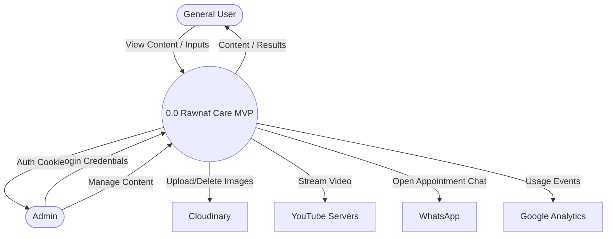
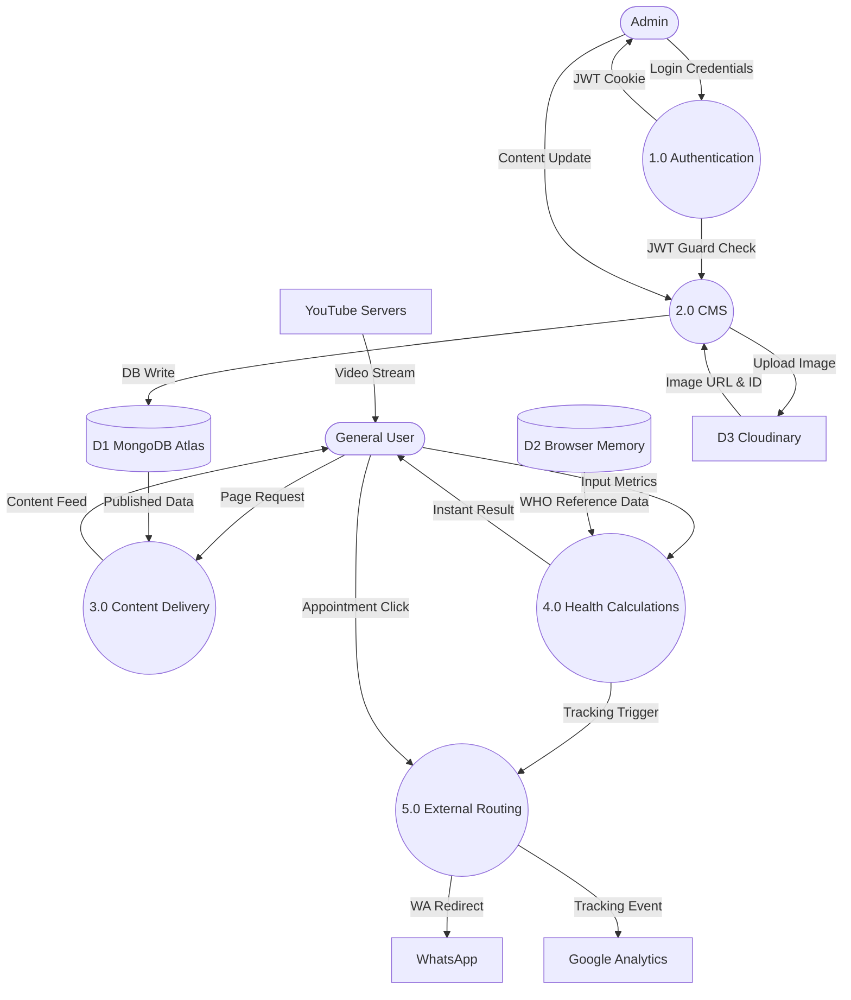
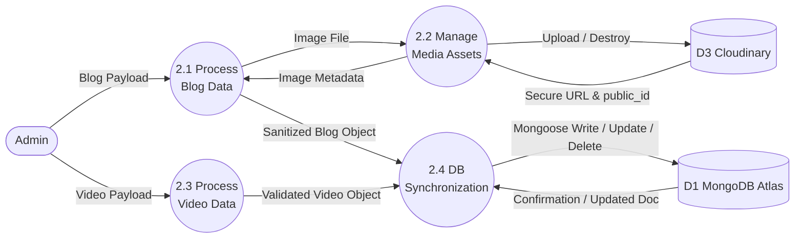

# Data Flow Diagram (DFD) - Rawnaf Care MVP

This document outlines the Data Flow Diagrams (Context, Level 1, and Level 2) and their accompanying metadata based on the architecture of the **Rawnaf Care MVP**.

---

## 1. Context Diagram (Level 0)

The Context Diagram shows the entire Rawnaf Care MVP system as a single process interacting with external entities.

### External Entities:
- **General User:** Browses content and uses calculators.
- **Admin:** Manages platform content.
- **YouTube:** Provides video streams.
- **WhatsApp:** Handles appointment messages.
- **Cloudinary:** Stores and serves images.
- **Google Analytics (GA4):** Tracks usage data.

---

## 2. Level 1 Diagram

The Level 1 Diagram breaks down the main system into its primary sub-processes based on the layered architecture.

### Primary Processes:
- **1.0 Authentication & Authorization:** Validates admin credentials and manages sessions.
- **2.0 Content Management System (CMS):** Handles CRUD operations for blogs and videos.
- **3.0 Content Delivery:** Serves published blogs and videos to the public.
- **4.0 Health Calculation Engine:** Processes user health inputs (stateless).
- **5.0 Analytics & External Redirection:** Handles external routing (WhatsApp) and tracking (GA4).

---

## 3. Level 2 Diagram (Zooming into 2.0 Content Management System)

This level breaks down process 2.0 (CMS) to show detailed data flow during content updates.

### Sub-Processes:
- **2.1 Process Blog Post Data:** Handles text content, slugs, and SEO metadata.
- **2.2 Manage Media Assets:** Uploads/Deletes images from Cloudinary.
- **2.3 Process Video Data:** Validates YouTube URLs and fetches thumbnails.
- **2.4 Database Synchronization:** Commits changes to MongoDB.

---

## 4. Data Dictionary

| Data Item | Description | Composition/Structure |
| :--- | :--- | :--- |
| **AdminCredentials** | Login details for Admin | `username` + `password` |
| **JWT_Token** | HttpOnly secure session token | Header + Payload (`admin_id`, `exp`) + Signature |
| **BlogPost** | Blog content entity | `title` + `slug` + `excerpt` + `content` + `image_url` + `cloudinary_public_id` + `status` + `seo_meta` |
| **VideoEntry** | Video content entity | `title` + `youtube_url` + `thumbnail_url` + `status` |
| **HealthMetrics** | User input for calculators | e.g., `height` + `weight` + `age` + `gender` + `waist_circumference` |
| **CalculationResult** | Output from calculators | e.g., `BMI_score` + `risk_category` + `percentile` |
| **MediaFile** | Image uploaded by Admin | Binary image data (Max 2MB, JPEG/PNG/WEBP) |
| **ImageURL/ID** | Cloudinary response | `secure_url` + `public_id` |
| **WHO_PercentileData** | Static reference dataset for Child Growth Tracker | LMS tables (Lambda, Mu, Sigma) stored in `lib/data/who-percentiles.json`; covers WHO 0–5 yrs & 5–19 yrs standards for Weight-for-age, Height-for-age, BMI-for-age, Head Circumference-for-age |

---

## 5. Data Flow Table

| Flow Name | Source | Destination | Description |
| :--- | :--- | :--- | :--- |
| `Login Request` | Admin | 1.0 Authentication | Admin credentials (username + password) |
| `Auth Token` | 1.0 Authentication | Admin Browser | JWT stored as HttpOnly SameSite=None Secure cookie |
| `JWT Guard Check` | 1.0 Authentication | 2.0 CMS | Token verification signal that authorizes CMS write access |
| `Content Update` | Admin | 2.0 CMS | Blog/Video creation or edit payloads (after JWT is verified) |
| `Upload Image` | 2.0 CMS | D3 Cloudinary | Multipart form data image file |
| `Image URL` | D3 Cloudinary | 2.0 CMS | Hosted `secure_url` and `public_id` returned after upload |
| `DB Write` | 2.0 CMS | D1 MongoDB | Saving new or updated Blog/Video document |
| `Read Request` | General User | 3.0 Content Delivery | HTTP GET request for blog/video feed |
| `DB Read` | D1 MongoDB | 3.0 Content Delivery | Fetching published content (filtered, paginated) |
| `Content Feed` | 3.0 Content Delivery | General User | Paginated blog/video list as JSON response |
| `Input Metrics` | General User | 4.0 Calculation Engine | Age, Weight, Height, Waist, LMP, etc. (client-side only) |
| `WHO Reference Data` | D2 Browser Memory | 4.0 Calculation Engine | Static WHO LMS percentile JSON loaded into memory |
| `Instant Result` | 4.0 Calculation Engine | General User | Calculated health result (BMI, Percentile, Risk Score, etc.) |
| `WA Redirect` | 5.0 External Routing | WhatsApp | `wa.me` URL opened with prefilled appointment message |
| `Tracking Event` | 5.0 External Routing | Google Analytics | GA4 `gtag()` event call (calculator_used, page_view) |
| `Video Stream` | YouTube Servers | General User | Embedded YouTube player streams video inside modal |

---

## 6. Process Table

| Process ID | Process Name | Description | Inputs | Outputs |
| :--- | :--- | :--- | :--- | :--- |
| 0.0 | Rawnaf Care System | Core web platform MVP | Credentials, Metrics, Content | View, Results, Tokens |
| 1.0 | Authentication | Validates admin access | AdminCredentials | JWT_Token |
| 2.0 | Content Mgmt (CMS) | CRUD operations | Content Update, MediaFile | DB Write, ImageURL |
| 3.0 | Content Delivery | Serves public content | Read Request, DB Read | Content Feed |
| 4.0 | Calculation Engine | Stateless health tools | HealthMetrics | CalculationResult |
| 5.0 | External Routing | GA4 tracking & WhatsApp | UI Interaction | Tracking Event, WA Redirect |

---

## 7. Data Store Table

| Store ID | Store Name | Type | Description |
| :--- | :--- | :--- | :--- |
| **D1** | MongoDB Atlas | NoSQL DB | Stores Blogs, Videos, and Admin user document. |
| **D2** | Browser Memory | Client State | React state for stateless calculator processing. (Temporary) |
| **D3** | Cloudinary Storage| Object Store | Stores featured images for blog posts. |

---

## 8. Mermaid Diagrams

### 8.1 Context Diagram


### 8.2 Level 1 Diagram


### 8.3 Level 2 Diagram (CMS Expansion)

> **Note:** Process 2.3 internally validates YouTube URL via regex and derives thumbnail URL. These are internal computations with no outbound data flow to an external store, so no self-referencing arrow is needed.



---

## 9. Draw.io XML

*Copy the XML below → open Draw.io → Extras → Edit Diagram → paste and click OK. This renders the full Context Diagram with all entities and labeled arrows.*

```xml
<mxGraphModel dx="1422" dy="762" grid="1" gridSize="10" guides="1" tooltips="1" connect="1" arrows="1" fold="1" page="1" pageScale="1" pageWidth="1169" pageHeight="827" math="0" shadow="0">
  <root>
    <mxCell id="0" />
    <mxCell id="1" parent="0" />

    <!-- ===== CENTRAL PROCESS 0.0 ===== -->
    <mxCell id="sys" value="0.0&#xa;Rawnaf Care MVP" style="ellipse;whiteSpace=wrap;html=1;fillColor=#dae8fc;strokeColor=#6c8ebf;fontSize=13;fontStyle=1;" vertex="1" parent="1">
      <mxGeometry x="480" y="330" width="160" height="160" as="geometry" />
    </mxCell>

    <!-- ===== EXTERNAL ENTITIES ===== -->
    <mxCell id="user" value="General User" style="rounded=0;whiteSpace=wrap;html=1;fillColor=#d5e8d4;strokeColor=#82b366;fontStyle=1;" vertex="1" parent="1">
      <mxGeometry x="80" y="360" width="140" height="60" as="geometry" />
    </mxCell>
    <mxCell id="admin" value="Admin" style="rounded=0;whiteSpace=wrap;html=1;fillColor=#ffe6cc;strokeColor=#d6b656;fontStyle=1;" vertex="1" parent="1">
      <mxGeometry x="490" y="80" width="140" height="60" as="geometry" />
    </mxCell>
    <mxCell id="cloud" value="D3 Cloudinary&#xa;(Media Storage)" style="rounded=0;whiteSpace=wrap;html=1;fillColor=#e1d5e7;strokeColor=#9673a6;fontStyle=1;" vertex="1" parent="1">
      <mxGeometry x="880" y="240" width="160" height="60" as="geometry" />
    </mxCell>
    <mxCell id="ga" value="Google Analytics&#xa;(GA4)" style="rounded=0;whiteSpace=wrap;html=1;fillColor=#fff2cc;strokeColor=#d6b656;fontStyle=1;" vertex="1" parent="1">
      <mxGeometry x="880" y="380" width="160" height="60" as="geometry" />
    </mxCell>
    <mxCell id="wa" value="WhatsApp" style="rounded=0;whiteSpace=wrap;html=1;fillColor=#d5e8d4;strokeColor=#82b366;fontStyle=1;" vertex="1" parent="1">
      <mxGeometry x="880" y="500" width="160" height="60" as="geometry" />
    </mxCell>
    <mxCell id="yt" value="YouTube Servers" style="rounded=0;whiteSpace=wrap;html=1;fillColor=#f8cecc;strokeColor=#b85450;fontStyle=1;" vertex="1" parent="1">
      <mxGeometry x="490" y="630" width="140" height="60" as="geometry" />
    </mxCell>

    <!-- ===== LABELED EDGES ===== -->
    <!-- User --> System -->
    <mxCell id="e1" value="View Content / Input Metrics" style="edgeStyle=orthogonalEdgeStyle;rounded=0;html=1;fontSize=10;" edge="1" parent="1" source="user" target="sys">
      <mxGeometry relative="1" as="geometry" />
    </mxCell>
    <!-- System --> User -->
    <mxCell id="e2" value="Content Feed / Calculation Results" style="edgeStyle=orthogonalEdgeStyle;rounded=0;html=1;fontSize=10;exitX=0;exitY=0.75;exitDx=0;exitDy=0;" edge="1" parent="1" source="sys" target="user">
      <mxGeometry relative="1" as="geometry" />
    </mxCell>
    <!-- Admin --> System -->
    <mxCell id="e3" value="Login Credentials / Content Updates" style="edgeStyle=orthogonalEdgeStyle;rounded=0;html=1;fontSize=10;" edge="1" parent="1" source="admin" target="sys">
      <mxGeometry relative="1" as="geometry" />
    </mxCell>
    <!-- System --> Admin -->
    <mxCell id="e4" value="JWT Auth Cookie" style="edgeStyle=orthogonalEdgeStyle;rounded=0;html=1;fontSize=10;exitX=0.75;exitY=0;exitDx=0;exitDy=0;" edge="1" parent="1" source="sys" target="admin">
      <mxGeometry relative="1" as="geometry" />
    </mxCell>
    <!-- System --> Cloudinary -->
    <mxCell id="e5" value="Upload / Delete Image" style="edgeStyle=orthogonalEdgeStyle;rounded=0;html=1;fontSize=10;" edge="1" parent="1" source="sys" target="cloud">
      <mxGeometry relative="1" as="geometry" />
    </mxCell>
    <!-- Cloudinary --> System -->
    <mxCell id="e6" value="Image URL &amp; public_id" style="edgeStyle=orthogonalEdgeStyle;rounded=0;html=1;fontSize=10;exitX=0;exitY=0.75;exitDx=0;exitDy=0;" edge="1" parent="1" source="cloud" target="sys">
      <mxGeometry relative="1" as="geometry" />
    </mxCell>
    <!-- System --> GA4 -->
    <mxCell id="e7" value="Usage / Calculator Events" style="edgeStyle=orthogonalEdgeStyle;rounded=0;html=1;fontSize=10;" edge="1" parent="1" source="sys" target="ga">
      <mxGeometry relative="1" as="geometry" />
    </mxCell>
    <!-- System --> WhatsApp -->
    <mxCell id="e8" value="Open Appointment Chat (wa.me)" style="edgeStyle=orthogonalEdgeStyle;rounded=0;html=1;fontSize=10;" edge="1" parent="1" source="sys" target="wa">
      <mxGeometry relative="1" as="geometry" />
    </mxCell>
    <!-- YouTube --> User -->
    <mxCell id="e9" value="Video Stream (Embedded Modal)" style="edgeStyle=orthogonalEdgeStyle;rounded=0;html=1;fontSize=10;" edge="1" parent="1" source="yt" target="user">
      <mxGeometry relative="1" as="geometry" />
    </mxCell>
  </root>
</mxGraphModel>
```

---

## 10. Validation Report

| Checkpoint | Status | Notes |
| :--- | :--- | :--- |
| **All 6 external entities connected?** | ✅ Pass | General User, Admin, Cloudinary, GA4, WhatsApp, and YouTube are all represented in the Context Diagram (Mermaid 8.1 & Draw.io XML). |
| **All 5 Level 1 processes present?** | ✅ Pass | P1.0 Auth, P2.0 CMS, P3.0 Content Delivery, P4.0 Health Calculations, and P5.0 External Routing are all included in Mermaid 8.2. |
| **No "Miracle" Processes?** | ✅ Pass | Every process has at least one labeled input before producing an output. E.g., P3.0 requires `Page Request` + `DB Read` to produce `Content Feed`. |
| **No "Black Hole" Processes?** | ✅ Pass | Every process produces at least one labeled output. E.g., P4.0 produces `Instant Result`; P2.0 produces `DB Write` and `Image URL`. |
| **No invalid DFD self-loops?** | ✅ Pass | The previous P23 self-loop has been removed. YouTube URL validation and thumbnail derivation are now correctly treated as internal computations within P2.3, not as data flows. |
| **Data stores connected properly?** | ✅ Pass | D1 (MongoDB), D2 (Browser Memory), and D3 (Cloudinary) connect only to processes, never directly to external entities. |
| **Cloudinary return flow present?** | ✅ Pass | `Image URL & public_id` flow from D3 Cloudinary → P2.0 CMS is shown in Mermaid 8.2 and Draw.io XML. |
| **JWT guard flow documented?** | ✅ Pass | `JWT Guard Check` flow from P1.0 Authentication → P2.0 CMS is present in the Data Flow Table (Section 5) and Level 1 Mermaid (Section 8.2). |
| **WHO reference data documented?** | ✅ Pass | `WHO_PercentileData` is in the Data Dictionary (Section 4) and `WHO Reference Data` flow from D2 → P4.0 is in the Data Flow Table (Section 5) and Level 1 Mermaid (Section 8.2). |
| **Draw.io edge labels present?** | ✅ Pass | All 9 edges in the Draw.io XML (Section 9) carry descriptive `value` labels matching the Data Flow Table. |
| **Level balancing maintained?** | ✅ Pass | Level 1 processes (1.0–5.0) fully encapsulate all inputs/outputs from the Level 0 Context Diagram. Level 2 (2.1–2.4) correctly decomposes P2.0 CMS without violating DFD notation rules. |
| **Compliance with Architecture?** | ✅ Pass | Calculators remain isolated from D1 MongoDB (no health data persisted). CMS uses SameSite=None JWT guard per the security architecture. WHO data served from static D2 Browser Memory per the frontend data strategy. |
